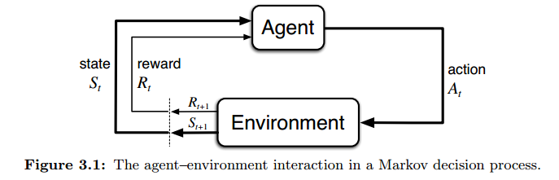

# Chapter 3:  Finite Markov Decision Processes
RL problem can be mathematically formalized as Markov decision processes (MDPs). Why MDPs?

- formalization of sequential decision making
- actions that impact both immediate rewards and subsequent situations (or states) => influence future rewards
- Involve both immediate + delayed rewards => the need to tradeoff among these
- estimate value $q*(s, a)$ for each action $a$ in each state $s$, or the value $v*(s)$ for each state given that optimal actions have been selected.

There are also other methods to formalize RL beyong MDPs. Those are discussed in Chapter 17.

## 3.1 The Agent-Environment Interface

The MDP and the agent together give rise to a trajectory: $S_0, A_0, R_1, S_1, A_1, R_2, S_2, A_3, R_3, S_3,...$

In finite MDPs, the sets of states, actions, and rewards are finite.

The random variables $R_t$ and $S_t$ are dependent ONLY on the state and the action at the immediately preceding time step $S_{t-1}$ and $A_{t-1}$ (Markov property). The following function $p$ defines the dynamic of the MDP:

$p(s', r | s, a) \doteq Pr\{ S_t = s', R_t=r | S_{t-1}=s, A_{t-1}=a \}$

<u>*Note</u>: the set of actions is denoted as $\mathcal{A}(s)$, indicating that there could be different sets of available actions for different environment's states 

The boundary between agent and environment: anything that an agent cannot change arbitrarily is considered to be outside of it and thus part of its environment. 

We always consider that the reward computation process to be external to the agent. However, note that the agent–environment boundary represents the limit of the agent’s absolute control, not of its knowledge. The agent may know a bit or everything about how the environment works, but this does not mean the solution is completely apparent to the agent.

- The Rubik's cube problem: we know clearly how it works, but how to solve it is still not straightfoward and sophisticated algorithms are required. 
- The agent can just know a bit about how the environment works, but is still able to solve it. How to achieve this? - Major question of RL research.

Assumption: the learning capacity (including its algorithm, computing structure and resources) of the agent is constant and is not affected by its performance (rewards received). This may be beyond what is needed from many applications, but should be considered when comparing RL agents with natural biological organisms.

Representational choices of states, actions, and rewards are essential, but may belong more to art than science.

- Each state or action can be a list / vector
- but, rewards are always single numbers

## 3.2 Goals and Rewards

My question: what is the relation between the two following questions: "what reward we need to choose to make a robot learn to walk" and "How walking has evolved? or Why there are walking behaviour in organisms?"

The agent’s goal is to maximize the cumulative reward it receives in the long run.

It is profoundly critical to indicate reward wisely such that it reflect truly what we actually want to accomplish. Indicating inappropriate reward to an agent may make it come up with a solution that is best to achieve the unescessary goal but entirely detrimental to the real goal. 

>The reward signal is your way of communicating to the robot what you want it to achieve, not how you want it achieved.

## 3.3 Returns and Episodes

Objective of maximization: the expected return $G_t \doteq R_{t+1} + R_{t+2} + R_{t+3}+...+R_T$ where $T$ is the final time step.

Task can be either:

- Episodic: The agent-environment interaction breaks into subsequences of *episodes* with limited number of time step - $T$ is a natural number. Each episode ends at time step $T$, falling into a special state called the terminal state, then everything is reset back to a standard starting state or to a sample from a standard distribution of starting states. Non-terminal states are distinguished from the terminal state --> the set of non-terminal states is $\mathcal{S}$, while set of all states including the terminal state is $\mathcal{S}^+$. $T$ can be a random variable that varies from episode to episode.
- Continuing: no limit for the time of interaction - $T=\infty$ --> Would be difficult to estimate and maximize the return, since it would be infinite. --> The utilization of discounting and the expected discounted return

Discount rate $0 \leq \gamma \leq 1$ determines how the expected discounted return depends on rewards at future time steps. Discounted return: $G_t \doteq R_{t+1} + \gamma R_{t+2} + \gamma^2 R_{t+3}+... = R_{t+1} + \gamma G_{t+1}$

- $\gamma = 0$: only the immediate reward matters --> "myopic" agent
- $\gamma=1$: go back to normal expected return, which will be infinite in continuing tasks
- $0 < \gamma < 1$: decreasing weights for rewards at later time steps. Discounted return is finite as $t \rightarrow \infty$

- Episodic task: $G_t \doteq \sum_{k=0}^{T-1} \gamma^k R_{t+k+1}$
- Continuing task: $G_t \doteq \sum_{k=0}^\infty \gamma^k R_{t+k+1}$

*<u>Exercise 3.5</u>*: For episodic tasks, $\sum_{s' \in \mathcal{S}^+} \sum_{r \in R} p(s', r | s, a) =1$, for all $s \in \mathcal{S}^+, a \in \mathcal{A(s)}$

<u>*Exercise 3.6*</u>: Each episode ends when a failure occur, then everything is reset. So, $R_T = -1$ and $G_T = 0$ .
$$
G_T = 0 \\
G_{T-1} = R_T + \gamma G_T = -1 \\
G_{T-2} = R_{T-1} + \gamma G_{T-1} = 0 + \gamma (-1) = -\gamma \\
G_{T-3} = R_{T-2} + \gamma G_{T-2} = 0 + \gamma (-\gamma) = -\gamma^2 \\
\Rightarrow G_i = -\gamma^{T-(i+1)} = -\gamma^{T-i-1}
$$
for $0 < i < T$

<u>*Exercise 3.7*</u>: The maze problem is different from the pole-balancing problem in such a way that in the later one, a failure can very easily occur which forces the agent to try best, but in the former one, the agent does not feel any pressure being running around the maze for a long time. In the maze problem, the agent can keep running around without escaping but still achieve a constant reward of zero and because it has not escaped the maze, it doesn't know that it can achieve a higher reward. A better approach could be assgining a punishment whose strength increases as time being in the maze goes by. In this case, we probably have not been very precise in what we want to achieve. It turns out that it's not just we want the robot to escape the maze, but we want it escape the maze as quickly as possible.

*<u>Exercise 3.8</u>*: $G_5 =0; \\ G_4 = R_5 + \gamma G_5 =2; \\ G_3 = R_4 + \gamma G_4 =4; \\ G_2 = R_3 + \gamma G_3 = 8; \\ G_1 = R_2 + \gamma G_2 = 6; \\ G_0 = R_1 + \gamma G_1 = 2$

<u>*Exercise 3.9*</u>: 
$$
G_0 = R_1 + \gamma G_1 = 2+0.9G_1 \\ 
G_1 = R_2 + \gamma R_3 + \gamma^2 R_4 + ... = 7 + \gamma 7 + \gamma^2 7+... = 7\sum_{k=0}^\infty \gamma^k = \frac {7} {1-\gamma} = 70\\
\Rightarrow G_0 = 2 + 0.9*70 = 65
$$

## 3.4 Unified Notation for Episodic and Continuing Tasks

In episodic tasks, absorbing state = end of an episode where all further rewards are zeroes. 

The general formula for the expected (discounted) return for both continuing & episodic task:

$ G_t \doteq \sum_{k=t+1}^T \gamma^{k-t-1}R_k $ where if $T$ can be either definite or $\infty$.

## 3.5 Policies and Value Functions

Policy $\pi$ at time $t$ is the probability $\pi(A_t = a | S_t = s)$

The expected value of a random variable given that the agent follows policy $\pi$ is $\mathbb{E}_\pi[...]$

The value function of a state $s$ under a policy $\pi$ is $v_\pi(s) \doteq \mathbb{E}_\pi[G_t | S_t = s]$

The value function of taking an action $a$ when being at a state $s$ under a policy $\pi$ is $q_\pi(s,a) \doteq \mathbb{E}_\pi(G_t | S_t=s, A_t=a)$. $q_\pi$ is also called the action-value function for policy $\pi$.

<u>*Exercise 3.11*</u>: $\mathbb{E}_\pi[R_{t+1} | S_t] = \sum_{a \in \mathcal{A}(S_t)} \pi(a | S_t) * r(a, S_t) = \sum_{a \in \mathcal{A}(S_t)} \pi(a | S_t) \cdot \sum_{r \in \mathcal{R}} r \cdot \sum_{s' \in \mathcal{S}} p(s', r | a, S_t)$

<u>*Exercise 3.12*</u>: $v_\pi(s) = \sum_{a \in \mathcal{A}(s)} \pi(a|s) \cdot q_\pi(s, a)$

<u>*Exercise 3.13*</u>:
$$
q_\pi(s, a) = \mathbb{E}_\pi(G_t | s, a) = r(s, a) + \gamma \mathbb{E}_\pi(G_{t+1}| s,a) \\
= \sum_{s'} \sum_r r \cdot p(s', r | s, a) + \gamma \sum_{s'} \mathbb{E}_\pi(G_{t+1} | s') Pr(s' | s, a) \\
= \sum_{s'} \sum_r r \cdot p(s', r | s, a) + \gamma \sum_{s'} v_\pi(s') \sum_r p(s', r | s, a) \\
= \sum_{s'} \sum_r p(s', r | s, a) \cdot [r + \gamma v_\pi(s')]
$$
Value functions can be estimated by either:

- experience: as time approaches infinity, the average of received returns will eventually converge to the actual value
- treating the value functions as parameterized functions whose parameters are fitted to the observed returns by an approximator (e.g. neural networks)

***Bellman equation for $v_\pi$***:
$$
v_\pi(s) = \sum_a \pi(a|s) \cdot q_\pi(s, a)\\
= \sum_a \pi(a|s) \sum_{s'} \sum_r p(s', r | s, a) \cdot [r + \gamma v_\pi(s')] \\
= \sum_a \sum_{s'} \sum_r \pi(a|s) \cdot p(s', r | s, a) \cdot [r + \gamma v_\pi(s')]
$$

## 3.6 Optimal Policies and Optimal Value Functions

Optimal policy(-ies) $\pi*$ with optimal value functions $v*(s) \doteq \max_\pi v_\pi(s)$ and $q*(a, s) = \max_\pi q_\pi(s, a)$

